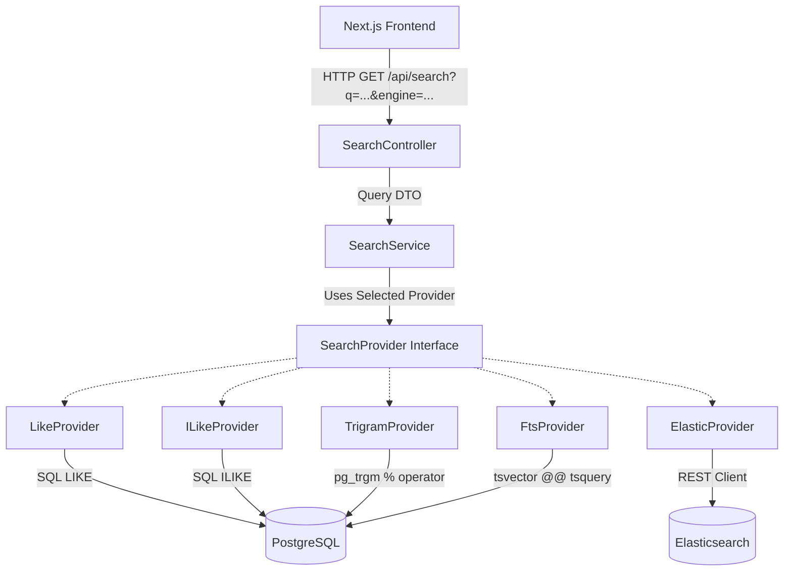

# From LIKE to Elasticsearch 🚀

An educational showcase project demonstrating the evolution of search in backend applications by comparing multiple search strategies using the exact same dataset.

This repository compares:
1. **SQL `LIKE`**: Case-sensitive sequential substring scans.
2. **SQL `ILIKE`**: Case-insensitive sequential substring scans.
3. **PostgreSQL Trigram Search (`pg_trgm`)**: Index-assisted fuzzy string matching.
4. **PostgreSQL Full-Text Search (FTS)**: Lexeme-based inverted index search with stemming and weighting.
5. **Elasticsearch**: Dedicated Apache Lucene-powered BM25 search engine with autocomplete analyzers.

---

## Architecture Diagram



---

## Tech Stack

*   **Backend**: NestJS (TypeScript)
*   **Frontend**: Next.js (TypeScript)
*   **Database**: PostgreSQL
*   **Search Server**: Elasticsearch 8.8.2
*   **ORM**: Prisma v7 (with native driver adapter `PrismaPg`)
*   **Data Generation**: `@faker-js/faker`

---

## Comparison Matrix

| Feature | SQL LIKE | SQL ILIKE | Trigram Search | PostgreSQL FTS | Elasticsearch |
| :--- | :---: | :---: | :---: | :---: | :---: |
| **Case Sensitivity** | Yes (Exact) | No | No | No | No |
| **Fuzzy Matching** | ❌ | ❌ | Yes (Trigram Similarity) | ❌ | Yes (Damerau-Levenshtein) |
| **Stemming / Lexemes**| ❌ | ❌ | ❌ | Yes (Dictionaries) | Yes (Analyzers) |
| **Field Boosting** | ❌ | ❌ | ❌ | Yes (setweight) | Yes (Field weights `name^3`) |
| **Performance** | Slow (Seq Scan) | Slow (Seq Scan) | Fast (GIN Index) | Fast (GIN Index) | Ultra-Fast (Inverted Index) |
| **Highlighting** | ❌ | ❌ | ❌ | Yes (ts_headline) | Yes (JSON fragments) |

---

## Core Database & Search Mappings

### 1. Trigram Setup
Enables fuzzy matching with indexing:
```sql
CREATE EXTENSION IF NOT EXISTS pg_trgm;
CREATE INDEX IF NOT EXISTS products_name_trgm_idx ON products USING gin (name gin_trgm_ops);
CREATE INDEX IF NOT EXISTS products_description_trgm_idx ON products USING gin (description gin_trgm_ops);
```

### 2. Full-Text Search (FTS) Column Configuration
Uses weighted fields (A for name, B for description, C for brand & category) and indexes them:
```sql
ALTER TABLE products ADD COLUMN search_vector tsvector GENERATED ALWAYS AS (
  setweight(to_tsvector('english', coalesce(name, '')), 'A') ||
  setweight(to_tsvector('english', coalesce(description, '')), 'B') ||
  setweight(to_tsvector('english', coalesce(brand, '')), 'C') ||
  setweight(to_tsvector('english', coalesce(category, '')), 'C')
) STORED;

CREATE INDEX products_search_vector_idx ON products USING gin (search_vector);
```

### 3. Elasticsearch Autocomplete Mappings
Configures custom tokenizers (`edge_ngram`) for real-time search suggestions:
```json
{
  "settings": {
    "analysis": {
      "analyzer": {
        "autocomplete": {
          "type": "custom",
          "tokenizer": "autocomplete_tokenizer",
          "filter": ["lowercase"]
        }
      },
      "tokenizer": {
        "autocomplete_tokenizer": {
          "type": "edge_ngram",
          "min_gram": 2,
          "max_gram": 15,
          "token_chars": ["letter", "digit"]
        }
      }
    }
  }
}
```

---

## Getting Started

### Prerequisites
*   Docker & Docker Compose
*   Node.js (v18+)

### 1. Run Infrastructures
Start PostgreSQL and Elasticsearch:
```bash
docker compose up -d
```

### 2. Initialize Database & Seed (200k Products)
Installs dependencies, runs schema mappings, generates 200,000 realistic mock products, and seeds both PostgreSQL and Elasticsearch:
```bash
cd backend
npm install
npx prisma generate
npx prisma db push

# Create PostgreSQL database extensions & indices
docker exec -i search-evolution-postgres psql -U postgres -d search_evolution -c "CREATE EXTENSION IF NOT EXISTS pg_trgm; CREATE INDEX IF NOT EXISTS products_name_trgm_idx ON products USING gin (name gin_trgm_ops); CREATE INDEX IF NOT EXISTS products_description_trgm_idx ON products USING gin (description gin_trgm_ops); ALTER TABLE products ADD COLUMN IF NOT EXISTS search_vector tsvector GENERATED ALWAYS AS (setweight(to_tsvector('english', coalesce(name, '')), 'A') || setweight(to_tsvector('english', coalesce(description, '')), 'B') || setweight(to_tsvector('english', coalesce(brand, '')), 'C') || setweight(to_tsvector('english', coalesce(category, '')), 'C')) STORED; CREATE INDEX IF NOT EXISTS products_search_vector_idx ON products USING gin (search_vector);"

# Run seed script
npx ts-node prisma/seed.ts
```

### 3. Run Backend API Server
Starts NestJS server on `http://localhost:3001`:
```bash
npm run start:dev
```

### 4. Run Frontend Dashboard
Starts Next.js server on `http://localhost:3000`:
```bash
cd ../frontend
npm install
npm run dev
```

---

## Educational Value & Learnings

By searching terms like `"Apple Laptop Pro"`, `"nike shoes"`, or `"iphne"` (typo), you will notice:
*   `LIKE`/`ILIKE` queries fail on typos and run slow due to Seq Scans.
*   Trigram search handles `"iphne"` fuzzy matches immediately using the GIN index.
*   FTS performs stemming (matching `"running"` to `"run"`), ranks matches, and highlights matching words.
*   Elasticsearch scores results using the BM25 formula, boosts title matches over descriptions, and resolves typo-tolerant suggestions in sub-milliseconds.
